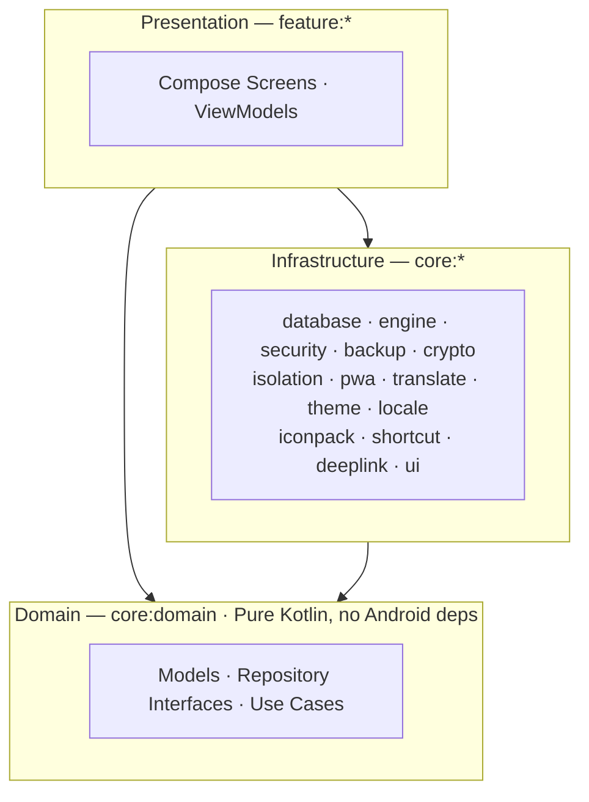

<h1 align="center">
  
  <br>
  Shellify
</h1>

<p align="center"><strong>Turn any website into an isolated, ad-free app on your home screen.</strong></p>

<div align="center">

[](https://github.com/smellouk/shellify/releases/latest)
[](https://github.com/smellouk/shellify/releases)
[](https://github.com/smellouk/shellify/stargazers)
[](LICENSE)
[](https://github.com/smellouk/shellify/actions/workflows/main.yml)

</div>

<div align="center">

[](https://github.com/smellouk/shellify/releases/latest)
[](https://apps.obtainium.imranr.dev/redirect?r=obtainium://app/%7B%22id%22%3A%22io.shellify.app%22%2C%22url%22%3A%22https%3A//github.com/smellouk/shellify%22%2C%22author%22%3A%22smellouk%22%2C%22name%22%3A%22Shellify%22%2C%22preferredApkIndex%22%3A0%2C%22additionalSettings%22%3A%22%7B%5C%22includePrereleases%5C%22%3Afalse%2C%5C%22fallbackToOlderReleases%5C%22%3Atrue%2C%5C%22filterReleaseTitlesByRegEx%5C%22%3A%5C%22%5C%22%2C%5C%22filterReleaseNotesByRegEx%5C%22%3A%5C%22%5C%22%2C%5C%22verifyLatestTag%5C%22%3Afalse%2C%5C%22dontSortReleasesList%5C%22%3Afalse%2C%5C%22useLatestAssetDateAsReleaseDate%5C%22%3Afalse%2C%5C%22trackOnly%5C%22%3Afalse%2C%5C%22versionExtractionRegEx%5C%22%3A%5C%22%5C%22%2C%5C%22matchGroupToUse%5C%22%3A%5C%22%5C%22%2C%5C%22versionDetection%5C%22%3Atrue%2C%5C%22releaseDateAsVersion%5C%22%3Afalse%2C%5C%22useVersionCodeAsOSVersion%5C%22%3Afalse%2C%5C%22apkFilterRegEx%5C%22%3A%5C%22%5C%22%2C%5C%22invertAPKFilter%5C%22%3Afalse%2C%5C%22autoApkFilterByArch%5C%22%3Atrue%2C%5C%22appName%5C%22%3A%5C%22Shellify%5C%22%2C%5C%22exemptFromBackgroundUpdates%5C%22%3Afalse%2C%5C%22skipUpdateNotifications%5C%22%3Afalse%2C%5C%22about%5C%22%3A%5C%22A%20local-first%20Android%20PWA%20launcher%20that%20wraps%20websites%20in%20isolated%20WebView%20containers%20with%20per-app%20ad%20blocking%2C%20biometric%20lock%2C%20and%20encrypted%20backup.%5C%22%2C%5C%22appAuthor%5C%22%3A%5C%22smellouk%5C%22%7D%22%2C%22overrideSource%22%3Anull%7D)

</div>

<div align="center">

### Signing Certificate Fingerprints

Use these to verify the APK signature.

```
SHA-256: EF:A3:C6:37:40:77:87:EE:97:18:58:7C:DE:FE:3F:86:02:E2:41:05:49:BE:DE:71:8F:4E:4D:74:EB:0C:23:21
SHA-1: 75:F2:73:AF:01:93:EF:08:F3:F2:2F:8C:B2:EA:FE:8B:BC:A0:27:73
```

</div>


---

<table>
<tr>
<td valign="top" width="60%">

## Features

- **PWA launcher** — Add any HTTPS website as a standalone home-screen app with its own icon, name, and theme color
- **Per-app isolation** — Each app gets its own cookie jar, local storage, and (Android 13+) dedicated WebView profile
- **Ad blocking** — Built-in content blocker with per-app custom rules
- **Translation** — In-page translation via Google Translate; configurable per app
- **App lock** — Optional password or biometric lock per app or globally
- **Two browser engines** — Android System WebView (default) or Mozilla GeckoView (optional download)
- **User-agent switching** — Chrome, Firefox, Safari, Edge, or custom user-agent per app
- **Encrypted backup** — AES-256-GCM backup files protected with a user-chosen password (Argon2id key derivation); manual or scheduled
- **Home-screen shortcuts** — Android launcher shortcuts for individual web apps
- **Icon packs** — Simple Icons integration for brand logos; custom icon selection
- **Material You** — Dynamic theming, dark/light/system mode, custom accent colors
- **Deep linking** — Share app configurations via QR code, link, or `shellify://` URI
- **Multilingual** — English, French, and Arabic

</td>
<td valign="top" align="center" width="40%">

## Demo


</td>
</tr>
</table>

---

## Requirements

| Tool | Version |
|---|---|
| Android Studio | Ladybug or newer |
| JDK | 17 |
| Gradle | wrapper included |
| Android SDK | Compile SDK 36, Min SDK 26 |

Minimum device: **Android 8.0 (API 26)**
Target: **Android 15 (API 36)**

---

## Getting Started

```bash
# Clone
git clone https://github.com/smellouk/shellify.git
cd shellify

# Build debug APK
./gradlew assembleDebug

# Install on connected device
./gradlew installDebug

# Build release APK (requires signing config)
./gradlew assembleRelease
```

The project uses **convention plugins** defined in `build-logic/` — no manual SDK path configuration is required beyond a standard Android Studio setup.

---

## Architecture

Shellify follows **Clean Architecture** with strict layer separation enforced by Konsist at compile time.



- **`core:domain`** — Pure Kotlin (no Android dependency). Defines all models, repository interfaces, and use cases.
- **`core:*`** — Infrastructure modules that implement domain interfaces (database, engine, security, backup, etc.).
- **`feature:*`** — Presentation layer only. Each feature module contains screens and ViewModels; no direct data access.
- **`core:ui`** — Shared design system: composables, typography, spacing tokens, Material 3 theme.

Dependency direction: `feature → core:domain`, `core:* → core:domain`. Feature modules never depend on each other.

---

## Supported Features

### Web Apps
| Feature | Detail |
|---|---|
| PWA launcher | Add any website as a standalone home-screen app — name, icon, and theme color auto-detected from the manifest |
| Per-app isolation | Dedicated cookie jar and local storage per app; Android 13+ gets a named WebView profile |
| Ad blocking | Built-in content blocker with per-app enable/disable and custom rule support |
| In-page translation | Google Translate JS injection — configurable source/target language per app |
| User-agent override | Chrome, Firefox, Safari, Edge, or fully custom string per app |
| Fullscreen mode | Hides system bars for immersive web apps |
| Control center | Floating toolbar for quick access to reload, translate, and settings |

### Browser Engines
| Engine | Notes |
|---|---|
| Android System WebView | Default — uses the Chromium-based WebView already on the device |
| Mozilla GeckoView | Optional — user-initiated download; switchable per app without reinstalling |

### Notifications
| Feature | Detail |
|---|---|
| In-app notifications | Web `Notification` API support with per-app allow/deny |
| Background notifications | Foreground service with a dedicated GeckoView session for apps that need push-style alerts |
| Notification channels | Per-app Android notification channel, grouped by category; channel removed when app is deleted |
| DND scheduling | Per-app quiet hours (start/end hour) to suppress notifications |
| Rate limiting | 100 notifications per app per day maximum |
| Notification history | In-app log of recent notifications per app |

### Security & Privacy
| Feature | Detail |
|---|---|
| App lock | Optional password or biometric (fingerprint / face) lock per app |
| Global password | Single password that gates all locked apps |
| Wipe on failed attempts | Optional data wipe after N incorrect password entries |
| Encrypted database | SQLCipher AES-256 — database is unreadable without the app key |
| Encrypted backup | `.pwab` archive — Argon2id key derivation + AES-256-GCM cipher |
| Screenshot protection | Optional `FLAG_SECURE` to block screen capture |
| Incognito sessions | Ephemeral WebView session that wipes cookies and profile on exit |

### Backup & Restore
| Feature | Detail |
|---|---|
| Manual backup | Export to any folder via Android SAF |
| Scheduled backup | Weekly or monthly via WorkManager |
| Cross-device restore | `.pwab` files are portable — restore with the same password on any device |
| Backup contents | Database, icons, settings, cookies (re-encrypted), WebView profiles (Android 13+) |

### Customization & UX
| Feature | Detail |
|---|---|
| Icon packs | Simple Icons integration — 3 000+ brand SVG logos rendered to PNG |
| Custom icons | Pick any image from storage |
| Material You | Dynamic color from wallpaper; light / dark / system mode |
| Home-screen shortcuts | Android launcher shortcuts with the app's icon and theme color |
| Categories | Group apps into named categories; filter the home grid |
| Deep linking | Import apps via `shellify://` URI, HTTPS link, or QR code scan |
| Multilingual | English, French, Arabic (runtime switchable) |

---

## Navigation

Navigation uses **Jetpack Compose Navigation**. All routes are defined in `Screen.kt`; the graph is assembled in `AppNavigation.kt`.

**Start destination logic:**

```
consent not given  →  ConsentScreen
onboarding not done  →  OnboardingScreen
otherwise  →  HomeScreen
```

Bottom navigation (Home, Categories, Shortcuts, Settings) is only visible on top-level routes.

---

## Deep Linking

Two URI schemes are registered for importing app configurations:

| Scheme | Example |
|---|---|
| Custom | `shellify://add?url=<base64url-encoded-https-url>&name=<app-name>` |
| HTTPS | `https://shellify.app/add?url=<base64url-encoded-https-url>&name=<app-name>` |

The URL parameter must be **Base64url-encoded** (no padding) and must decode to an `https://` URL — HTTP is rejected.

A confirmation dialog showing the destination host is displayed before any app is added.

**Test with ADB:**

```bash
# Encode a URL
ENCODED=$(printf '%s' "https://youtube.com" | base64 | tr '+/' '-_' | tr -d '=')

# Fire the deep link
adb shell am start -a android.intent.action.VIEW \
  -d "shellify://add?url=${ENCODED}&name=YouTube" \
  io.shellify.app
```

---

## Backup

Backup files use the `.pwab` extension (an encrypted ZIP archive).

- **Encryption:** Argon2id key derivation → AES-256-GCM cipher
- **Contents:** Database dump, icons, settings, cookies (re-encrypted into archive), WebView profiles (Android 13+)
- **Excluded:** App password hash, database passphrase, backup password — all device-specific secrets are never exported
- **Storage:** User-selected folder via Android Storage Access Framework (SAF)
- **Schedule:** Manual, weekly, or monthly via WorkManager
- **Cross-device:** `.pwab` files are portable — restore on any device using the same password

---

## Testing

```bash
# Unit tests — includes Konsist architecture checks
./gradlew testDebugUnitTest

# Screenshot regression tests
./gradlew verifyRoborazziDebug

# Instrumented tests (requires connected device or emulator)
./gradlew :app:connectedDebugAndroidTest

# Full local check suite
./gradlew detekt lintDebug testDebugUnitTest
```

| Layer | Framework |
|---|---|
| Unit tests | JUnit 4 + MockK |
| Compose UI tests | Compose UI Test (JUnit4 rule) |
| Screenshot tests | Roborazzi (Robolectric runner) — golden images committed alongside UI changes |
| Architecture tests | Konsist — enforces Clean Architecture layer boundaries |
| Database tests | Room in-memory database |

Instrumented smoke tests cover navigation, consent gate, deep-link dialogs, and key screens end-to-end.

### Developer Tools

`docs/tools.html` is a single-page in-app test harness for manual feature testing. Serve it locally and load it inside Shellify:

```bash
# Tunnel host port 8080 to the device
adb reverse tcp:8080 tcp:8080

# Serve the docs folder (Python)
python3 -m http.server 8080 --directory docs
```

Then open `http://localhost:8080/tools.html` as a Shellify web app. Available tabs:

| Tab | What it tests |
|---|---|
| **Chrome Tools** | `ShellifyBridge` Java interface — direct notification dispatch, rate limit, and truncation via the Chromium WebView |
| **GeckoView Tools** | Web `Notification` API via Gecko — permission flow, foreground fire, and 10-second background timer |

---

## Code Quality

| Tool | Purpose |
|---|---|
| **Detekt** | Static analysis + ktlint formatting; config in `config/detekt/detekt.yml` |
| **Android Lint** | Resource, accessibility, and API-level checks; config in `config/lint/lint.xml` |
| **Konsist** | Architecture consistency — fails the build if layer rules are violated |

```bash
# Run Detekt
./gradlew detekt

# Run Lint
./gradlew lintDebug
```

---

## Tech Stack

| Component | Library |
|---|---|
| Language | Kotlin |
| UI | Jetpack Compose + Material 3 |
| Navigation | Navigation Compose |
| Database | Room + SQLCipher |
| Preferences | DataStore |
| Networking | OkHttp |
| Image loading | Coil (+ SVG) |
| Browser engine | System WebView + GeckoView (optional) |
| QR codes | ZXing Core |
| Biometrics | AndroidX Biometric |
| Background work | WorkManager |
| DI | Manual (ViewModel factories, no framework) |
| Build | AGP + KSP |

---

## Roadmap

See [`.planning/ROADMAP.md`](.planning/ROADMAP.md) for the full phase breakdown. Active milestone: **v2 — Privacy-First Feature Parity**.

---

## Localization

Three languages are supported at runtime, switchable from the onboarding screen or settings:

| Code | Language |
|---|---|
| `en` | English (default) |
| `fr` | French |
| `ar` | Arabic |

String resources live in `core/ui/src/main/res/values/strings.xml` (canonical English) and mirrored to `app/src/main/res/values-fr/` and `app/src/main/res/values-ar/`.

---

## Privacy

Shellify is local-first. No account, no cloud sync, no analytics, no crash reporting.

The only outbound network calls are:

- Favicon fetch from the user's chosen domain
- PWA manifest detection from the user's chosen domain
- Optional Simple Icons library download (`cdn.jsdelivr.net`)
- Optional GeckoView engine download (`maven.mozilla.org`), user-initiated
- Translation requests (`translate.googleapis.com`), only when translation is enabled for an app

Full details: [`docs/legal/privacy.md`](docs/legal/privacy.md)

---

## Legal

- **Terms of Service:** [`docs/legal/terms.md`](docs/legal/terms.md)
- **Privacy Policy:** [`docs/legal/privacy.md`](docs/legal/privacy.md)
- **Branding:** The "Shellify" name, logo, and project branding are identifiers of the official project and are not granted under the open-source license. See [`NOTICE`](NOTICE).

---

## Contact

[contact@shellify.app](mailto:contact@shellify.app)
