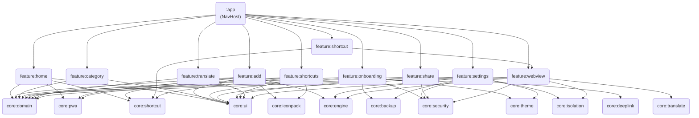

# `feature/*`

> Presentation-layer modules — each one is an isolated screen or flow that the user sees.

## Overview

The `feature/` directory is the parent of 10 Android library modules that together make up every screen in Shellify. They sit at the top of the dependency graph: they depend on `core:*` modules but never on each other. Navigation between features is done through the app-level navigation graph in the `:app` module, keeping inter-feature coupling to zero.

## Purpose

Each feature module owns exactly one logical user-facing flow:

| Module | Responsibility |
|---|---|
| `feature:add` | Add / edit a PWA (URL analysis + form) |
| `feature:category` | Category CRUD |
| `feature:home` | App grid, search, filter |
| `feature:link-dispatcher` | URL dispatch: "Open with", share sheet, shellify://open deep link |
| `feature:onboarding` | First-run consent wizard |
| `feature:settings` | Per-app and global settings |
| `feature:share` | QR code + deep-link export |
| `feature:shortcut` | Launcher-shortcut trampoline activity |
| `feature:shortcuts` | Manage pinned shortcuts list |
| `feature:translate` | Per-app translation config |
| `feature:webview` | Full-screen PWA browser |

## Key Classes / Files

Every feature module follows the same internal layout:

```
feature/<name>/
  src/main/java/io/shellify/feature/<name>/
    <Name>Screen.kt          # Composable screen (or Activity for webview/shortcut)
    <Name>ViewModel.kt       # State holder; receives use cases via factory
    <Name>UiState.kt         # Sealed state class (optional, may be inline)
  build.gradle.kts
```

No feature module contains a `Repository`, `DAO`, or database reference. All data access flows through use cases from `core:domain`.

## Dependencies

### Gradle convention plugins applied to every feature module

```kotlin
// build.gradle.kts (typical)
plugins {
    alias(libs.plugins.shellify.android.library)
    alias(libs.plugins.shellify.compose)
}
```

- `shellify.android.library` — sets `compileSdk`, `minSdk`, lint, Kotlin options.
- `shellify.compose` — adds the Compose BOM, compiler plugin, and UI tooling.

### Core modules a feature may depend on

```
core:domain      — use cases + domain models (required by almost every feature)
core:ui          — shared Composables, theme tokens, typography
core:engine      — WebView / GeckoView engine abstraction
core:isolation   — per-app WebView profile / session isolation
core:security    — password & biometric lock
core:pwa         — PWA manifest analysis, icon processing
core:iconpack    — Simple Icons catalogue
core:shortcut    — launcher shortcut creation / removal
core:backup      — import / export
core:deeplink    — URI builder and parser for shellify:// scheme
core:translate   — TranslateBridge injection
core:theme       — ThemeManager, locale helper
core:locale      — language resolution
```

### Adding a new feature module

1. Create the directory under `feature/`.
2. Add `build.gradle.kts` with at minimum `shellify.android.library`.
3. Register the module in the root `settings.gradle.kts`:
   ```kotlin
   include(":feature:my-new-feature")
   ```
4. Wire navigation in `:app`'s nav graph — features are never navigated to directly from other features.

## Usage / How to navigate here

Feature modules are never launched directly from each other. Navigation flows through the `:app` NavHost:

```
HomeScreen → navigate("add")
HomeScreen → navigate("webview/{webAppId}")
AppSettingsScreen → navigate("translate/{webAppId}")
```

Deep-links (e.g., `shellify://add?url=...`) are resolved by `:app` and forwarded to the appropriate feature screen.

## Mermaid Diagram



## Configuration

- Konsist architecture tests (in `:test:konsist` or equivalent) enforce that no feature module imports `core:database` or any other `feature:*` module at the source level.
- ProGuard / R8 rules for each feature are inherited from `:app`'s `proguard-rules.pro`; add feature-specific rules only when a feature uses reflection (rare).
- All feature modules are included in the release build by default; none are dynamic delivery modules unless explicitly converted.
