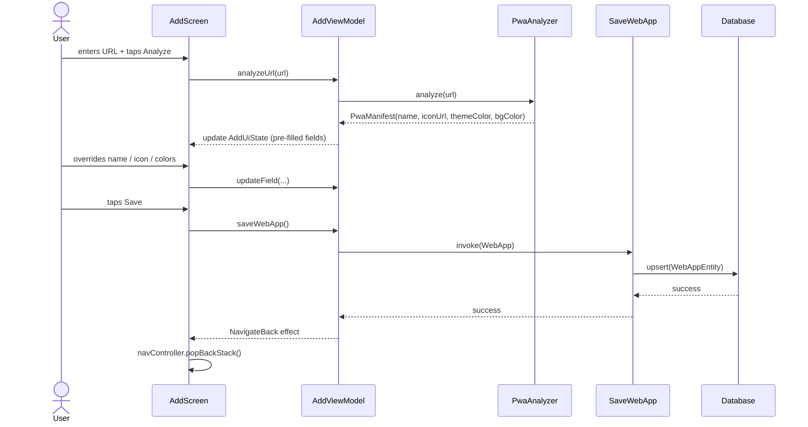

# `feature:add`

> Enter a URL and Shellify does the rest — fetch the manifest, pick an icon, save the PWA.

## Overview

`feature:add` handles both the **add** and **edit** flows for a `WebApp` entry. The user pastes a URL; `PwaAnalyzer` fetches the site's web manifest and populates the form automatically. Every field is overridable before saving. The same screen doubles as an edit form when launched with an existing `webAppId`.

## Purpose

- Accept a URL, analyze its PWA manifest, and pre-fill name, icon, and colors.
- Allow the user to override any auto-detected value.
- Let the user pick an icon from the bundled Simple Icons catalogue or supply a custom URL.
- Persist the result via `SaveWebApp` use case and return to the previous screen.
- Support deep-link entry (`shellify://add?url=...`) for share-into-Shellify flows.

## Key Classes / Files

### `AddViewModel`

```kotlin
class AddViewModel(
    private val pwaAnalyzer: PwaAnalyzer,
    private val saveWebApp: SaveWebApp,
    private val getWebAppById: GetWebAppById,
) : ViewModel()
```

| Responsibility | Detail |
|---|---|
| URL analysis | `analyzeUrl(url)` → launches coroutine → calls `PwaAnalyzer.analyze(url)` → emits `PwaManifest` |
| Form state | `StateFlow<AddUiState>` holding name, iconUrl, themeColor, bgColor, engineType |
| Pre-fill | On manifest result: auto-populates all fields; user edits are applied on top |
| Edit mode | If `webAppId != null` on init: calls `GetWebAppById` and pre-fills from existing `WebApp` |
| Save | `saveWebApp()` maps UI state → `WebApp` domain model → calls `SaveWebApp` use case → emits `NavigateBack` effect |
| Icon override | `selectIcon(SimpleIcon)` or `setCustomIconUrl(url)` update icon field independently |

### `AddScreen`

Top-level Composable.

| UI element | Behaviour |
|---|---|
| URL field + Analyze button | `OutlinedTextField` + `Button`; triggers `viewModel.analyzeUrl()` |
| Analysis progress | `LinearProgressIndicator` shown while coroutine is running |
| Icon picker | `LazyVerticalGrid` of Simple Icons + "Custom URL" option; opens `IconPickerSheet` |
| Name field | Editable; auto-filled from manifest `name` or `short_name` |
| Theme / background color pickers | `ColorPickerDialog` wired to manifest colors |
| Engine selector | `RadioGroup`: System WebView vs GeckoView |
| Save / Update button | Disabled until name + URL are non-empty; calls `viewModel.saveWebApp()` |

### `IconPickerSheet`

Modal bottom sheet inside this module. Shows a searchable grid of `SimpleIcon` entries from `core:iconpack`.

## Dependencies

```kotlin
// feature/add/build.gradle.kts
dependencies {
    implementation(project(":core:domain"))
    implementation(project(":core:iconpack"))
    implementation(project(":core:engine"))
    implementation(project(":core:shortcut"))
    implementation(project(":core:pwa"))
    implementation(project(":core:ui"))
}
```

Navigation targets (runtime, not compile-time):

- `feature:webview` — optional "Preview" action after save (navigates with new `webAppId`)

## Usage / How to navigate here

### From HomeScreen FAB

```kotlin
composable("add") {
    AddScreen(navController = navController, webAppId = null)
}
```

### Edit an existing app (from settings or long-press)

```kotlin
composable("add/{webAppId}") { backStackEntry ->
    AddScreen(
        navController = navController,
        webAppId = backStackEntry.arguments?.getString("webAppId"),
    )
}
```

### Deep-link (share-into)

```
shellify://add?url=https%3A%2F%2Fexample.com
```

Handled in `:app`'s `AndroidManifest.xml` deep-link intent filter; the nav graph extracts the `url` query param and passes it to `AddScreen` as a pre-filled URL.

## Mermaid Diagram



## String Resources

`feature:add` owns its own string resources under `src/main/res/values/strings.xml` (with `values-fr` and `values-ar` translations). Currently contains:

| Key | Default (en) |
|---|---|
| `add_error_duplicate` | `"%s" already exists` |

## Configuration

- **Deep-link scheme**: `shellify://add?url=<encoded-url>`. The scheme is declared in `:app`'s `AndroidManifest.xml`; `feature:add` does not register its own manifest entry.
- **GeckoView engine selector**: only shown if `core:engine` reports that GeckoView is installed (checked via `GeckoEngineManager.isAvailable()`). On devices where it is not installed, the selector is hidden and engine defaults to system WebView.
- **Icon search**: the Simple Icons catalogue is loaded lazily from `core:iconpack`'s bundled JSON asset; no network call is made for icon browsing.
