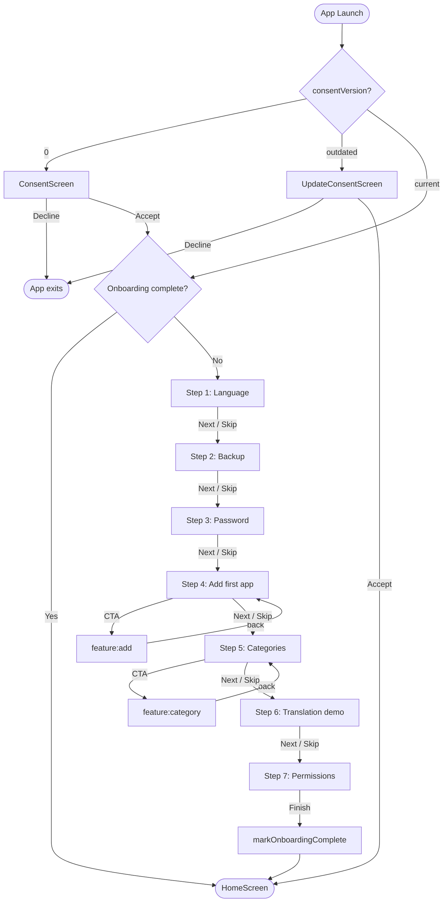

# `feature:onboarding`

> First impressions count — guide new users through consent, preferences, and their first PWA in seven steps.

## Overview

`feature:onboarding` is the mandatory entry point for every new installation of Shellify. It consists of three distinct screens: a non-skippable first-run consent gate (`ConsentScreen`), a re-consent gate for existing users when terms change (`UpdateConsentScreen`), and an optional seven-step setup wizard (`OnboardingScreen`). Completion flags are stored in DataStore and checked on every cold launch.

## Purpose

- Obtain informed consent (GDPR/privacy) before any user data is touched.
- Let the user configure language, backup, and password on first launch rather than requiring a settings detour.
- Walk through key features (add app, category, translation, permissions) so new users understand Shellify's capabilities immediately.
- Persist the completion state so the `:app` module can route cold launches directly to `feature:home`.

## Key Classes / Files

### `ConsentScreen`

```kotlin
@Composable
fun ConsentScreen(onAccepted: () -> Unit)
```

- Shown to first-time users only (`consentVersion == 0`).
- Scrollable summary of all key terms (6 sections) plus links to the full Privacy Policy and Terms of Service.
- **I Agree & Continue** (enabled once the checkbox is ticked) → `ThemeManager.setConsentGiven()` (writes `consent_given = true` and `consent_version = CURRENT_CONSENT_VERSION`) → routes to `OnboardingScreen`.
- **Decline** calls `finish()` on the host Activity — Shellify will not launch without consent.

### `UpdateConsentScreen`

```kotlin
@Composable
fun UpdateConsentScreen(onAccepted: () -> Unit)
```

- Shown to existing users when `consentVersion < ThemeManager.CURRENT_CONSENT_VERSION`.
- Summarises only what changed (bullet list) plus links to the full docs.
- **Accept & Continue** → `ThemeManager.setConsentVersion(CURRENT_CONSENT_VERSION)` → routes to `HomeScreen`.
- **Decline** closes the app, same as `ConsentScreen`.

### `OnboardingViewModel`

```kotlin
class OnboardingViewModel(
    private val themeManager: ThemeManager,
    private val backupManager: BackupManager,
    private val securityManager: SecurityManager,
    private val onboardingRepository: OnboardingRepository,
) : ViewModel()
```

| Responsibility | Detail |
|---|---|
| Step tracking | `currentStep: StateFlow<Int>` (0–6); `nextStep()` / `previousStep()` |
| Consent persistence | `markConsentAccepted()` → DataStore |
| Completion persistence | `markOnboardingComplete()` → DataStore; called after step 7 or final skip |
| Language selection | `selectLanguage(locale)` → `ThemeManager.selectedLanguage` + `AppCompatDelegate` |
| Backup setup | delegates to `BackupManager.configure(uri, schedule)` |
| Password setup | delegates to `SecurityManager.setGlobalPassword(password)` |
| Skip individual steps | each step exposes a `skip()` callback; wizard always advances forward |

### `OnboardingScreen`

Seven-step pager (Compose `HorizontalPager`):

| Step | Content |
|---|---|
| 1 | Language picker: `en` / `fr` / `ar` (RTL-aware) |
| 2 | Backup setup: choose folder via SAF picker + schedule toggle |
| 3 | Password setup: optional PIN / password with confirm field |
| 4 | Add first app: CTA card that routes to `feature:add`; returns here on back |
| 5 | Category creation: CTA card that routes to `feature:category` |
| 6 | Translation demo: brief explainer + toggle to enable for the just-added app |
| 7 | Permissions walkthrough: request notifications + storage (via `rememberPermissionState`) |

Each step shows a **Skip** link (except step 1, which can still be changed later in global settings) and a **Next / Finish** button.

## Dependencies

```kotlin
// feature/onboarding/build.gradle.kts
dependencies {
    implementation(project(":core:backup"))
    implementation(project(":core:domain"))
    implementation(project(":core:locale"))
    implementation(project(":core:pwa"))
    implementation(project(":core:security"))
    implementation(project(":core:theme"))
    implementation(project(":core:ui"))
}
```

Navigation targets (runtime):

- `feature:add` — step 4 CTA
- `feature:category` — step 5 CTA

## Usage / How to navigate here

`ShellifyApplication` checks the consent + onboarding completion flags synchronously on the main thread startup (via `runBlocking` on the DataStore first-emission):

```kotlin
// app/src/main/java/.../MainActivity.kt
val startDestination = if (!prefs.consentAccepted) "consent"
                       else if (!prefs.onboardingComplete) "onboarding"
                       else "home"
```

Once `markOnboardingComplete()` is called, the start destination permanently becomes `"home"`.

## Mermaid Diagram



## Configuration

- **Terms updates**: to require existing users to re-consent, increment `CURRENT_CONSENT_VERSION` in `ThemeManager`. Users whose stored `consent_version` is lower will see `UpdateConsentScreen` on the next launch. Update `consent_update_changes_*` strings to describe what changed.
- **Step order**: the step list is defined as a `List<OnboardingStep>` sealed class in `OnboardingViewModel`. Reordering or removing steps requires only changing that list — the `HorizontalPager` derives its page count dynamically.
- **RTL support**: step 1 language selection immediately triggers `AppCompatDelegate.setApplicationLocales()`, so the wizard itself re-renders in RTL for Arabic without requiring a restart.
- **Permission requests**: step 7 uses `accompanist-permissions` (or Compose `rememberPermissionState`). Declined permissions are not re-requested within the wizard; the user can grant them later via system settings.
